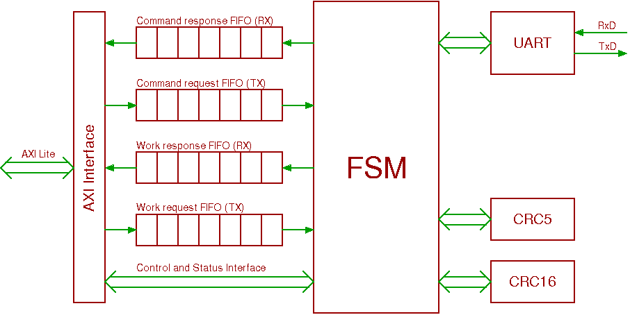

# FPGA Zynq IO Design

## General Parameters of the Platform

**Target Board:** S9

**Device:** xc7z010clg400-1

**Vivado Design Suite version:** 2017.4


## List of Implemented IP Cores

**FPGA design contains following IP cores:**
- axi_gpio - standard Xilinx GPIO module (2x)
- axi_iic - standard Xilinx I2C module (1x)
- axi_timer - standard Xilinx Timer module for PWM generation (1x)
- axi_uart16550 - standard Xilinx AXI UART 16550 module (6x)
- s9io - custom IP core for communication with hashing chips BM1387 (3x)

| Name of IP         | Type of IP                | Base address | Range  | IRQ             | Frequency [MHz] |
| ------------------ | ------------------------- | :----------: | :----: | :-------------: | :-------------: |
| axi_gpio_input     | Xilinx AXI GPIO v2.0      | 0x41200000   | 64kB   | false           | 50              |
| axi_gpio_output    | Xilinx AXI GPIO v2.0      | 0x41210000   | 64kB   | false           | 50              |
| axi_iic_0          | Xilinx AXI I2C v2.0       | 0x41600000   | 64kB   | true (61)       | 50              |
| axi_timer_0        | Xilinx AXI Timer v2.0     | 0x42800000   | 64kB   | false           | 50              |
| axi_uart16550_0    | Xilinx AXI UART16550 v2.0 | 0x43C00000   | 64kB   | true (62)       | 50              |
| axi_uart16550_1    | Xilinx AXI UART16550 v2.0 | 0x43C10000   | 64kB   | true (63)       | 50              |
| axi_uart16550_2    | Xilinx AXI UART16550 v2.0 | 0x43C20000   | 64kB   | true (64)       | 50              |
| axi_uart16550_3    | Xilinx AXI UART16550 v2.0 | 0x43C30000   | 64kB   | true (65)       | 50              |
| axi_uart16550_4    | Xilinx AXI UART16550 v2.0 | 0x43C40000   | 64kB   | true (66)       | 50              |
| s9io_5             | Braiins AXI S9IO v0.2     | 0x43C50000   | 64kB   | true (67,68,84) | 50              |
| s9io_6             | Braiins AXI S9IO v0.2     | 0x43C60000   | 64kB   | true (85..87)   | 50              |
| s9io_7             | Braiins AXI S9IO v0.2     | 0x43C70000   | 64kB   | true (88..90)   | 50              |
| axi_uart16550_8    | Xilinx AXI UART16550 v2.0 | 0x43C80000   | 64kB   | true (91)       | 50              |

s9io IP cores are connected to connectors J6, J7 and J8.

UART modules 0..4 and 8 are connected to ports J1..J5 and J9.

# S9IO IP Core Description
IP core is designed for sending control commands and work specifications into ASICs BM1387 used in Antminer S9 and provides basic post-processing of input data.
IP core contains following features:
- two interfaces - one is intended for control (commands) of the hashing chips and one for streaming mining works
- four register's windows (common, CMD, WORK_RX, WORK_TX) for independent access in parallel way (4kB each)
- FIFO buffers to hold of input and output data for command and work interfaces
- UART interface with configurable baud-rate
- CRC modules for calculation of checksum for work specifications (CRC16), commands (CRC5) and responses (CRC5)
- control and status registers
- IRQ ports for signaling state of FIFO buffers

Block diagram of IP core:



Size of FIFO buffers is set to:
- Command Interface Receive FIFO: 256 x 32b words
- Command Interface Transmit FIFO: 1024 x 32b words
- Work Interface Receive FIFO: 1024 x 32b words
- Work Interface Transmit FIFO: 2048 x 32b words


## IP Core AXI Interface
IP core can be configured through AXI4-Lite interface.
Registers are split into 4 windows:
- common registers
- command receive/transmit interface registers (CMD)
- work receive interface (WORK_RX)
- work transmit interface (WORK_TX)

Address map of registers available through AXI interface:

| Address | Name             | Access | Reset Value | Description                     |
| :-----: | ---------------- | :----: | :---------: | ------------------------------- |
| 0x0000  | VERSION          | R      | 0x00900200  | IP Core Version Register        |
| 0x0004  | BUILD_ID         | R      | BUILD_ID    | Build ID Register               |
| 0x0008  | CTRL_REG         | RW     | 0x0000      | Control Register                |
| 0x000C  | STAT_REG         | R      | 0x0000      | Status Register - reserved      |
| 0x0010  | BAUD_REG         | RW     | 0           | Baudrate Divisor Register       |
| 0x0014  | WORK_TIME        | RW     | 1           | Work Time Delay Register        |
| 0x0018  | ERR_COUNTER      | R      | 0           | Error Counter Register          |
| 0x1000  | CMD_RX_FIFO      | R      | X           | Command Receive Interface FIFO  |
| 0x1004  | CMD_TX_FIFO      | W      | -           | Command Transmit Interface FIFO |
| 0x1008  | CMD_CTRL_REG     | RW     | 0x0000      | Command Control Register        |
| 0x100C  | CMD_STAT_REG     | R      | 0x0005      | Command Status Register         |
| 0x2000  | WORK_RX_FIFO     | R      | X           | Work Receive Interface FIFO     |
| 0x2008  | WORK_RX_CTRL_REG | RW     | 0x0000      | Work Receive Control Register   |
| 0x200C  | WORK_RX_STAT_REG | R      | 0x0001      | Work Receive Status Register    |
| 0x3004  | WORK_TX_FIFO     | W      | -           | Work Transmit Interface FIFO    |
| 0x3008  | WORK_TX_CTRL_REG | RW     | 0x0000      | Work Transmit Control Register  |
| 0x300C  | WORK_TX_STAT_REG | R      | 0x0014      | Work Transmit Status Register   |
| 0x3010  | WORK_TX_IRQ_THR  | RW     | 0           | Work Transmit IRQ Threshold     |
| 0x3014  | WORK_TX_LAST_ID  | R      | 0           | Work Transmit Last Work ID      |


## IP Core Common Registers

### IP Core Version Register (VERSION)
Register contains verson of the IP core. Value is divided into following parts:
- bits 31..28 - miner type (0 = Antminer)
- bits 27..20 - IP core model (0x09 = S9)
- bits 19..16 - reserved
- bits 15..12 - IP core major version
- bits 11..8 - IP core minor version
- bits 7..0 - IP core patch version

Register is 32-bit width and it is read-only.


### Build ID Register (BUILD_ID)
Register contains Unix timestamp when the bitstream was generated. It can be used for identification of bitstream version.
HDL file _s9io_version.vhd_ with timestamp is generated automatically before synthesis.
Also file with build history is generated in directory _design_. File contains information about git commit used for build.
Build history file can contains a warning if the git work-tree is dirty (contains local changes).
In this case a full diff of git work-tree is stored in file _git.diff_ in build directory.
Register is 32-bit width and it is read-only.


### Control Register (CTRL_REG)
Control register provides commonc configuration of the IP core. Register contains following bits:

| Bits  | Name             | Access | Reset Value | Description                               |
| :---: | ---------------- | :----: | :---------: | ----------------------------------------- |
| 3     | ENABLE           | RW     | 0           | Enable of IP core                         |
| 2..1  | MIDSTATE_CNT     | RW     | 0           | Number of midstates per work              |
| 0     | ERR_CNT_CLEAR    | W      | 0           | Clear error counter                       |

Enable flag is common for whole IP core and must be enabled for any operation in other register's windows.

Number of midstates per work is encoded as log2 of number of midstates:
* 0 - 1 midstate
* 1 - 2 midstates
* 2 - 4 midstates
* 3 - reserved

Hard reset of buffers is supported by disabling of IP core. So, if a problem in communication with ASICs occurs then the IP core must be reinitialized.


### Status Register (STAT_REG)
Status register provides status of the IP core. Register is read-only and reserved for future use.


### Baudrate Divisor Register (BAUD_REG)
Baudrate divisor register defines value for modulo counter used for generation of synchronization pulses for UART receiver and transmitter.
Register is 32-bit width but only 12 LSBs are used for modulo counter.

Baudrate speed is defined by equation:
```
baudrate = f_CLK / (16 * (BAUD_REG + 1))    [Bd; Hz, -]
```
Value of baudrate register is calculated by equation:
```
BAUD_REG = (f_CLK / (16 * baudrate )) - 1    [-; Hz, Bd]
```
_f_CLK_ is frequency of AXI interface, in this case 50 MHz.
Register allows to set baudrate in range from 763 Bd/s to 3.125 MBd/s.


### Work Time Delay Register (WORK_TIME)
Work time delay register defines value of modulo counter used for generation of synchronization pulses for submitting command and work frames.
Register is 32-bit width but only 24 LSBs are used for modulo counter.

Delay is defined by equation:
```
delay = WORK_TIME / f_CLK   [s; -, Hz]
```
Value of work time register is calculated by equation:
```
WORK_TIME = delay * f_CLK   [-; s, Hz]
```
_f_CLK_ is frequency of AXI interface, in this case 50 MHz.

The value defines period between two work frames regardless of the used baudrate speed.
If both work and command buffers contains data, then the command frame is sent immediately after work frame within the time period.
This method allows to send command requests together with work requests without disruption of delay between work frames.

Register allows to set the period up to 335 ms. The lowest value of delay is determined by length of frames and used baudrate speed.
If the length of work frame (and/or command frame) is higher then set period then the next frame is sent immediately without any delay.


### Error Counter Register (ERR_COUNTER)
Register contains value of error counter. Counter is incremented if response frame is dropped due to CRC mismatch.
Register is 32-bit width and it is read-only. Register can be cleared by control register CTRL_REG.ERR_CNT_CLEAR.


## Command Interface Registers

### Command Receive Interface FIFO (CMD_RX_FIFO)
Receive command interface is intended for reading responses of control commands from ASICs.
Each response consists of two 32b words.

For example, incoming data
```
0x13, 0x87, 0x90, 0xf4, 0x00, 0x00, 0x1c
```
are converted into
```
0xf4908713, 0x1c000000
```

Where:
* the first word contains received bytes 3..0 (first received byte is on LSBs)
* the second word contains [CRC (8b), 0x00 (8b), received bytes 5..4 (16b)]

Register is 32-bit width and it is read-only. Register must be read only by 32b words because each read access increments pointer in the buffer.


### Command Transmit Interface FIFO (CMD_TX_FIFO)
Transmit command interface is intended for writing configurable commands into ASICs.
Data without CRC are written into register.
LSB byte is send as first through UART interface.

Example for 5 bytes command - data written into register
```
0x00fc0541
```
are converted into
```
0x41, 0x05, 0xfc, 0x00, 0x0b
```


Example for 9 bytes command - data written into register
```
0x0c000948, 0x21026800
```
are converted into
```
0x48, 0x09, 0x00, 0x0c, 0x00, 0x68, 0x02, 0x21, 0x02
```

Register is 32-bit width and it is write-only. Register must be written only by 32b words because each write access increments pointer in the buffer.

Note that current IP core supports only commands with maximum length of 9 bytes due to timing determinism of data sent through UART.
For commands with higher length then 9 bytes the timing is not guaranteed.


### Command Control Register (CMD_CTRL_REG)
Control register provides configuration of command window of the IP core. Register contains following bits:

| Bits  | Name         | Access | Reset Value | Description                                |
| :---: | ------------ | :----: | :---------: | ------------------------------------------ |
| 2     | IRQ_EN       | RW     | 0           | Enable interrupt for Command Receive FIFO  |
| 1     | RST_TX_FIFO  | W      | 0           | Reset/clear Command Transmit FIFO          |
| 0     | RST_RX_FIFO  | W      | 0           | Reset/clear Command Receive FIFO           |

Reset of FIFOs is provided synchronously according to the state of FSM. So the reset requests are suitable to flush of buffers when data in buffers are retired and new works have to be generated.


### Command Status Register (CMD_STAT_REG)
Status register provides status of command window of the IP core. Register contains following bits:

| Bits  | Name         | Access | Reset Value | Description                                |
| :---: | ------------ | :----: | :---------: | ------------------------------------------ |
| 4     | IRQ_PEND     | R      | 0           | Interrupt pending for Command Receive FIFO |
| 3     | TX_FULL      | R      | 0           | Command Interface Transmit FIFO Full       |
| 2     | TX_EMPTY     | R      | 1           | Command Interface Transmit FIFO Empty      |
| 1     | RX_FULL      | R      | 0           | Command Interface Receive FIFO Full        |
| 0     | RX_EMPTY     | R      | 1           | Command Interface Receive FIFO Empty       |


## Work Receive Interface Registers

### Work Receive Interface FIFO (WORK_RX_FIFO)
Receive work interface is intended for reading work responses from ASICs.
Each response consists of two 32b words.

For example, incoming data
```
0x72, 0x03, 0xea, 0x83, 0x00, 0x03, 0x98
```
are converted into
```
0x83ea0372, 0x98000300
```

Where:
* the first word contains nonce (first received byte is on LSBs)
* the second word contains [CRC (8b), extended work ID (16b), solution number (8b)]

Register is 32-bit width and it is read-only. Register must be read only by 32b words because each read access increments pointer in the buffer.


### Work Receive Control Register (WORK_RX_CTRL_REG)
Control register provides configuration of work receive window of the IP core. Register contains following bits:

| Bits  | Name         | Access | Reset Value | Description                               |
| :---: | ------------ | :----: | :---------: | ----------------------------------------- |
| 2     | IRQ_EN       | RW     | 0           | Enable interrupt for Work Receive FIFO    |
| 1     | reserved     | R      | 0           | reserved bit                              |
| 0     | RST_RX_FIFO  | W      | 0           | Reset/clear Work Receive FIFO             |

Reset of FIFOs is provided synchronously according to the state of FSM. So the reset requests are suitable to flush of buffers when data in buffers are retired and new works have to be generated.


### Work Receive Status Register (WORK_RX_STAT_REG)
Status register provides status of work receive window of the IP core. Register contains following bits:

| Bits  | Name         | Access | Reset Value | Description                               |
| :---: | ------------ | :----: | :---------: | ----------------------------------------- |
| 4     | IRQ_PEND     | R      | 0           | Interrupt pending for Work Receive FIFO   |
| 3..2  | reserved     | R      | 0           | reserved bits                             |
| 1     | RX_FULL      | R      | 0           | Work Interface Receive FIFO Full          |
| 0     | RX_EMPTY     | R      | 1           | Work Interface Receive FIFO Empty         |


## Work Transmit Interface Registers

### Work Transmit Interface FIFO (WORK_TX_FIFO)
Transmit work interface is intended for writing work specifications into ASICs.

Each mining work specification have the following format:

| Bytes   | Description                                  |
| :-----: | -------------------------------------------- |
| 0-3     | extended work ID                             |
| 4-7     | nbits (network difficulty) **little endian** |
| 8-11    | ntime  **little endian**                     |
| 12-15   | merkle root **little endian**                |
| 16-47   | midstate 0                                   |
| 48-79   | midstate 1 (only for 2 or 4 midstates work)  |
| 80-111  | midstate 2 (only for 4 midstates work)       |
| 112-143 | midstate 3 (only for 4 midstates work)       |

Extended work ID can be up to 16 bits. Lower 1 - 2 bits have to be 0 depending whether submitting work that contains 1, 2, or 4 midstates resp.
Words in midstates are in reverse order `State[7]..State[0]`. However, unlike **BM1387** specification words don't have to be in big endian, IP core performs the ordering change on its own.
Extended work ID allows pairing of assigned mining work with a result, currently, there are 7 bits available for the work ID send into ASICs. The work's IDs have to be assigned with a gap of # midstates (e.g. 0, 4, 8, 12 for 4 midstates, 0, 2, 4, ... for 2 midstates). The reason is that the chip communicates the midstate index via `work_id`.

Register is 32-bit width and it is write-only. Register must be written only by 32b words because each write access increments pointer in the buffer.


### Work Transmit Control Register (WORK_TX_CTRL_REG)
Control register provides configuration of work transmit window of the IP core. Register contains following bits:

| Bits  | Name         | Access | Reset Value | Description                               |
| :---: | ------------ | :----: | :---------: | ----------------------------------------- |
| 2     | IRQ_EN       | RW     | 0           | Enable interrupt for Work Transmit FIFO   |
| 1     | RST_TX_FIFO  | W      | 0           | Reset/clear Work Transmit FIFO            |
| 0     | reserved     | R      | 0           | reserved bit                              |

Reset of FIFOs is provided synchronously according to the state of FSM. So the reset requests are suitable to flush of buffers when data in buffers are retired and new works have to be generated.


### Work Transmit Status Register (WORK_TX_STAT_REG)
Status register provides status of work transmit window of the IP core. Register contains following bits:

| Bits  | Name         | Access | Reset Value | Description                               |
| :---: | ------------ | :----: | :---------: | ----------------------------------------- |
| 4     | IRQ_PEND     | R      | 1           | Interrupt pending for Work Transmit FIFO  |
| 3     | TX_FULL      | R      | 0           | Work Interface Transmit FIFO Full         |
| 2     | TX_EMPTY     | R      | 1           | Work Interface Transmit FIFO Empty        |
| 1..0  | reserved     | R      | 0           | reserved bits                             |


### Work IRQ Threshold Register (WORK_TX_IRQ_THR)
Work IRQ threshold register defines value used as trigger for generation of interrupt request for work TX FIFO.
Value defines minimum number of 32b words. Interrupt request is generated if the number of words in work TX  FIFO drop bellow defined value.


### Last Work ID Register (LAST_WORK_ID)
Register holds value of last work ID send to ASICs. ID is in full format.
Register is 32-bit width but only 16 LSBs are used. Register is read-only.


## Interrupt Request Ports
IP core has 3 interrupt ports for signaling state of FIFO buffers:
- irq_work_tx - is used for signaling if content of work transmit FIFO drop bellow value defined in register `WORK_TX_IRQ_THR`
- irq_work_rx - is used for signaling if work receive FIFO contains at least one work response
- irq_cmd_rx - is used for signaling if command receive FIFO contains at least one command response

Interrupt ports represent value of flag IRQ_PEND in status registers masked by IRQ enable bit IRQ_EN from control registers.

Interrupt flag WORK_TX_STAT_REG.IRQ_PEND is set when content of work transmit FIFO drop bellow value defined in register `WORK_TX_IRQ_THR`.
Interrupt flag WORK_TX_STAT_REG.IRQ_PEND is cleared when content of work transmit FIFO rise up value defined in register `WORK_TX_IRQ_THR`.

Interrupt flag WORK_RX_STAT_REG.IRQ_PEND is set when new work response is received and stored into receive FIFO.
Interrupt flag WORK_RX_STAT_REG.IRQ_PEND is cleared when user read from work receive FIFO.

Interrupt flag CMD_STAT_REG.IRQ_PEND is set when new command response is received and stored into receive FIFO.
Interrupt flag CMD_STAT_REG.IRQ_PEND is cleared when user read from command receive FIFO.

Flags WORK_RX_STAT_REG.IRQ_PEND and CMD_STAT_REG.IRQ_PEND are cleared on reset of individual FIFO by bit RST_RX_FIFO in control registers WORK_RX_CTRL_REG and CMD_CTRL_REG. The flags are also cleared when IP core is disabled.

ID of interrupt ports connected to the ARM should be (base is the lowest number defined in [table](#List-of-Implemented-IP-Cores)):
- irq_work_tx - (base + 0)
- irq_work_rx - (base + 1)
- irq_cmd_rx - (base + 2)


## CRC Calculation
IP core contains 4 modules for CRC calculation:
- CRC16 with polynomial 0x1021 used for work specifications
- CRC5 with polynomial 0x5 used for commands
- 2x CRC5 with modified structure based on polynomial 0xD used for responses (differ by init value)

CRC calculation is executed sequentially - it takes 8 clock cycles for one byte of input data.


## Synthesis and Verification
There are prepared TCL scripts for synthesis, implementation and bitstream generation. Scripts are located in directory /design. Main script is run.sh that calls Vivado tools. Script requires one input argument - name of board (S9). The process of generation bitstream is fully automated. You have to set only correct path to Vivado tools. You have to use the same version of Vivado Design Suite as is defined on the document begin (version of used IP cores have to match). Script creates directory /design/build\_\<board\_name\> with all temporary files. The whole process takes a long time; depending on the CPU it can be up to 30 minutes. The output files (bitstream, binary file, hardware description file) are located in directory /design/build\_\<board\_name\>/results. Directory /design/build\_\<board\_name\>/reports contains some reports that should be checked after implementation (e.g. results of static timing analysis).

TCL scripts include verification of s9io IP core that is run at end of the build. Vivado simulator is used for simulation of HDL files. Verification is based on self-check testbench where reference values are compared with computed.

Vivado 2017.4 contains bug that causes a "double free or corruption" error during exiting simulator. A patch is available on Xilinx web [1]. Directory with patch must be extracted in exact directory described in readme file. For example, the path to AR70455.dat file looks like:
```
~/.Xilinx/Vivado/2017.4/patches/AR70455/vivado/data/patches/AR70455.dat
```

You can check if the patch is correctly loaded by information that is printed when Vivado is started:
```
****** Vivado v2017.4_AR70455 (64-bit)
```

## References
[1] AR70455: 2017.4 Vivado Simulator Tactical Patch: https://www.xilinx.com/support/answers/70455.html

